|                             | Sine                                             | Plane                                             | Random Tree                                              | Make Classification                                              |
|-----------------------------|--------------------------------------------------|---------------------------------------------------|----------------------------------------------------------|------------------------------------------------------------------|
| Mutual Information          | 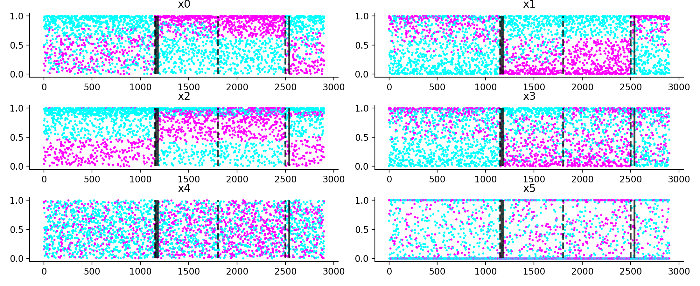    | 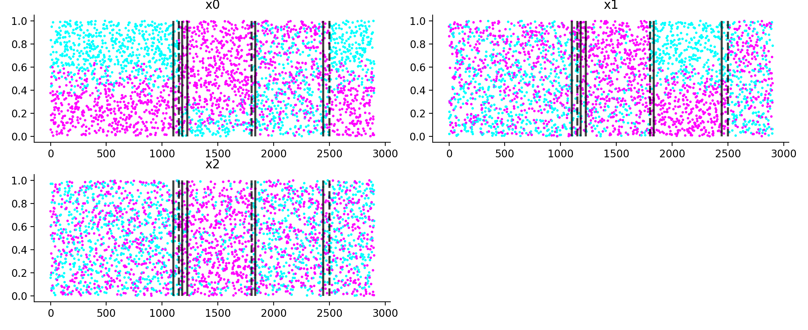   | 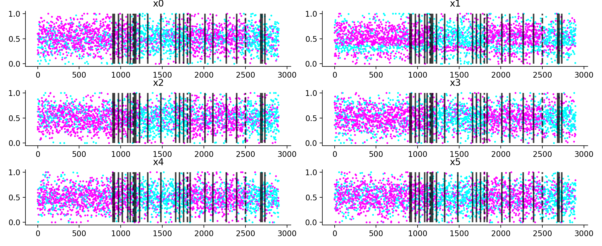 | 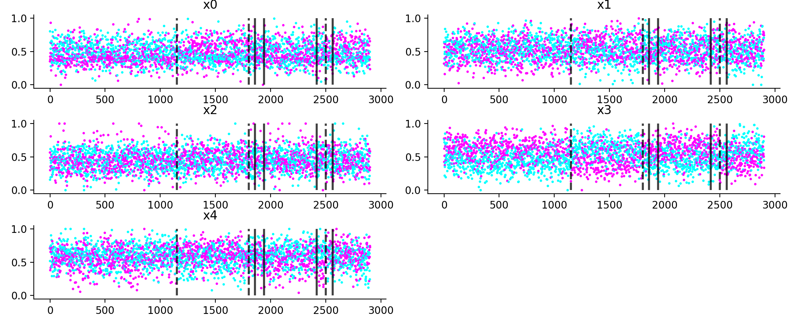 |
| Centroid Displacement (All) |  | 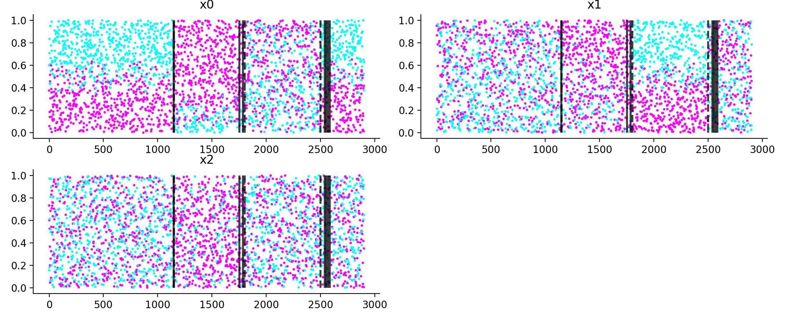  | 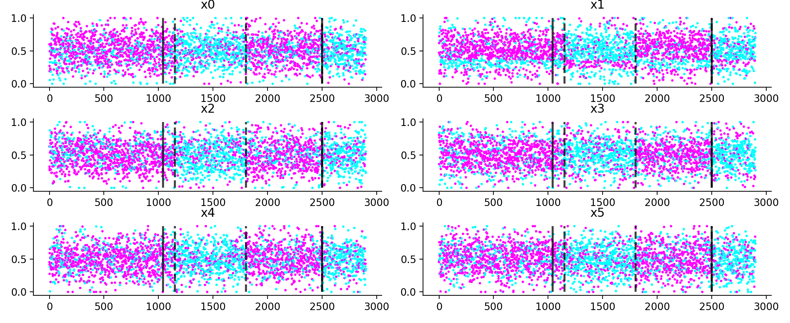  |   |
| Centroid Displacement (Any) |  | 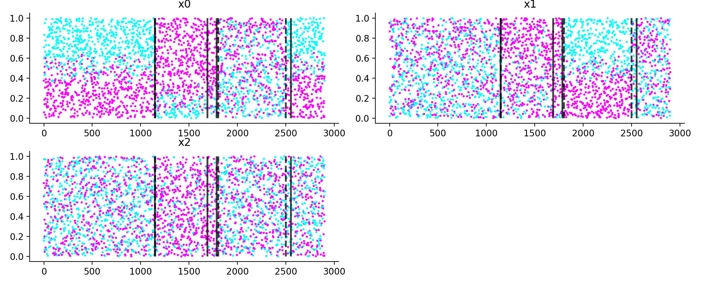  | 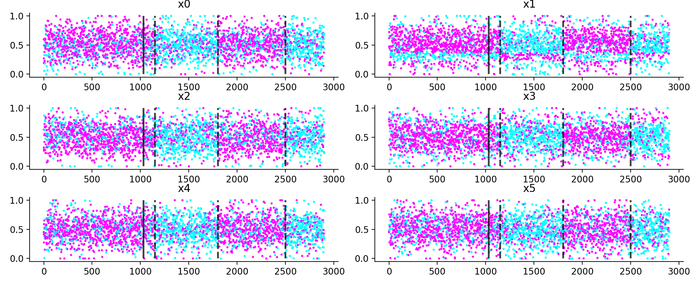  | 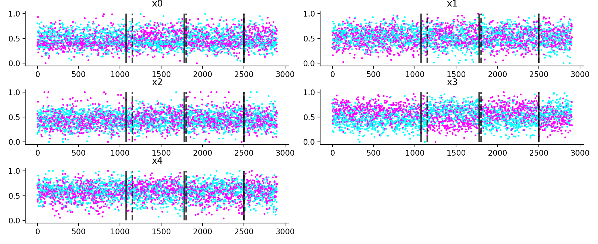 |
| Minimal Distance (All)      | 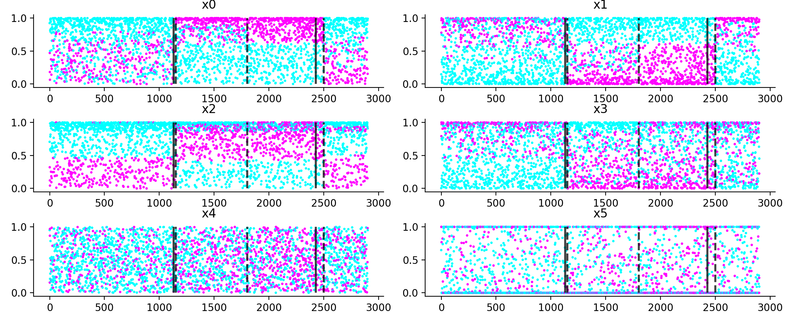 |  | 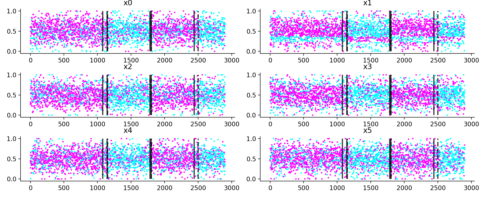   | 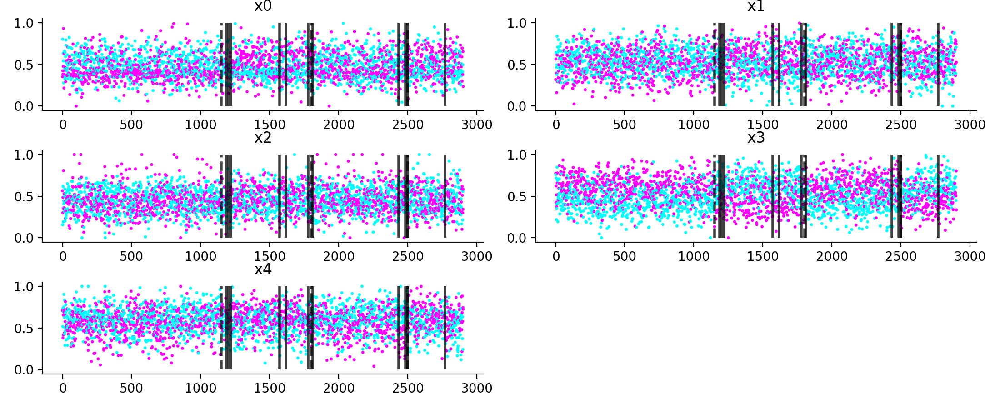   |
| Minimal Distance (Any)      |   | 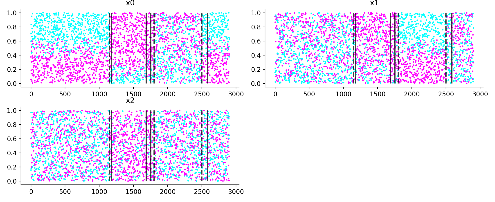  |   |    |
